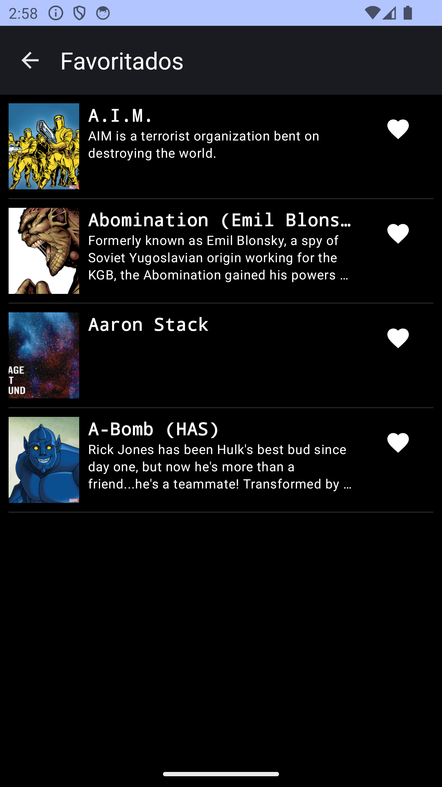

# MarvelCharacters
Android app to load Marvel Api's characters list

An android app that is fed by https://developer.marvel.com/docs., built with Kotlin using MVVM with clean architecture.

 |  | 

Dependencies used
--------

- Retrofit -> HTTP requests handling
- Android Architecture Components -> MVVM implementation
- Clean Architecture
- Coil -> Image downloading and caching
- Room database

How to use it
--------
Android Studio Hedgehog or newer
Update file br.com.francielilima.marvelcharacters.common.Constants with your API Keys

